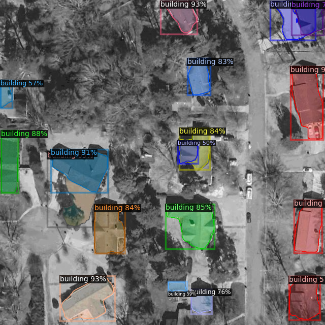

# 
Detect infrastructure from satellite images using Instance Segmentation 🚀

## Overview

This project focuses on infrastructure detection from satellite images utilizing advanced instance segmentation techniques. Leveraging cutting-edge computer vision algorithms, we aim to accurately identify and delineate various types of infrastructure such as buildings, roads, vegetation, and water within satellite imagery. By employing instance segmentation, we can not only detect the presence of infrastructure but also precisely outline individual instances, providing valuable insights for urban planning, disaster response, and environmental monitoring. This methodology involves training deep learning models on large datasets of annotated satellite images, enabling robust and efficient infrastructure detection at scale. Ultimately, this project contributes to enhancing the accessibility and usability of satellite imagery for a wide range of applications, facilitating informed decision-making and resource allocation in diverse fields.

## Examples

<!-- &nbsp;&nbsp;&nbsp;&nbsp;
 -->

## Dataset

Here, I have used [this](https://universe.roboflow.com/qgis/monster-nt6ca) satellite image detaset from Roboflow.